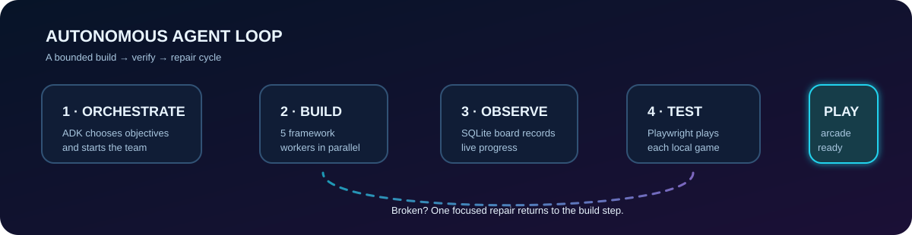
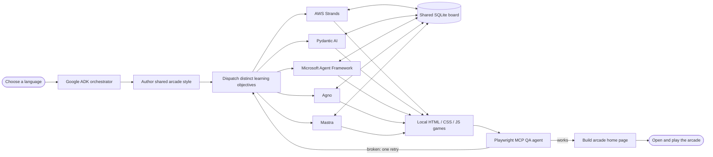
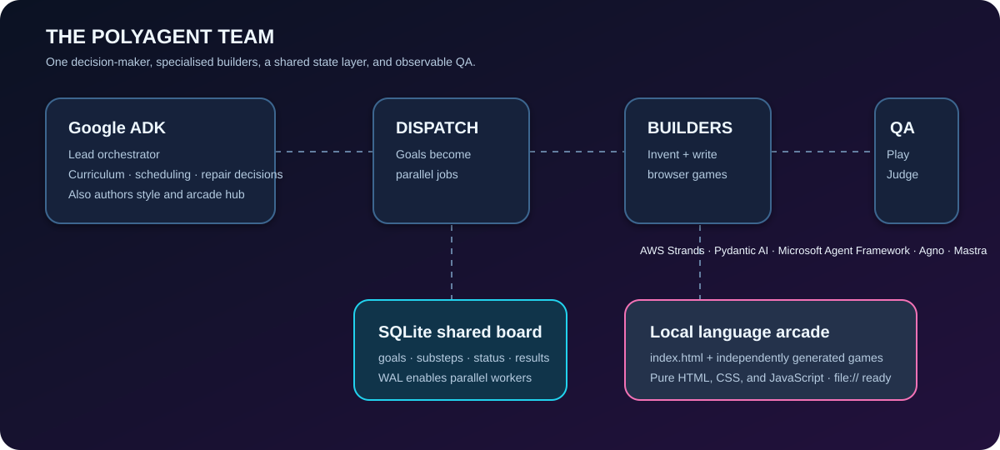

# PolyAgent Orchestrator

<p align="center">
  
</p>

<p align="center">
  
  
  
  
</p>

PolyAgent is an autonomous **agent loop** that turns a collection of framework-specific workers into a small language-learning web arcade. A Google ADK agent acts as the lead: it chooses learning objectives, launches independent builders in parallel, watches their shared task board, plays the finished games in a real browser, and gives a broken game one focused repair attempt.

<p align="center">
  
</p>

## What happens in one run



The loop is deliberately bounded: workers have timeouts, QA has a call budget, and each game is repaired at most once. That gives the coordinator room to act autonomously without letting a bad task retry forever.

<details>
<summary><strong>Explore the system roles</strong> — open the visual map</summary>

<br />
<p align="center">
  
</p>
</details>

## The team

| Role | Technology | Responsibility |
| --- | --- | --- |
| Lead orchestrator | Google ADK | Designs the curriculum, schedules work, evaluates QA results, and decides repairs. |
| Art director | Google ADK | Writes the shared `common.css` and final `index.html`, with deterministic templates as fallbacks. |
| Builders | Strands, Pydantic AI, Microsoft Agent Framework, Agno, Mastra | Each invents and writes one self-contained language game. |
| Shared memory | SQLite + WAL | Holds goals, worker-created substeps, status, and outcome notes. |
| QA tester | Google ADK + Playwright MCP | Opens each `file://` game in Chrome, interacts with it, checks for errors, and reports a verdict. |

## Quick start

This is the capstone folder from a five-framework learning workspace. It discovers the worker files in the adjacent Day 2–4 folders; missing workers are simply excluded. Run commands from this directory after setting the API keys required by the workers you have installed.

```bash
# Python 3.12+, uv, Node.js, and Google Chrome are required.
# Put credentials in the repository-root .env file.
GOOGLE_API_KEY=your_google_key
OPENAI_API_KEY=your_openai_key

# Optional: route the coordinator through a local OpenAI-compatible OmniRoute server.
OMNIROUTE_ENABLED=1
OMNIROUTE_API_KEY=your_omniroute_key
OMNIROUTE_BASE_URL=http://localhost:20128/v1

# Build the default Spanish arcade.
uv run agent_loop.py

# Build a different curriculum.
uv run agent_loop.py --language Japanese

# Work with the builders available on your machine, excluding selected ones.
uv run agent_loop.py --skip mastra maf

# Inspect the discovered team without making model calls.
uv run agent_loop.py --dry-run
```

When the run completes, open `site/index.html`. Every game is plain local HTML, CSS, and JavaScript, so it works directly from disk without a web server.

## Project map

```text
agent_loop.py      CLI entry point: discovers workers and starts the run
orchestrator.py    ADK coordinator and its bounded execution tools
catalog.py         Worker manifest, discovery, and subprocess launch commands
board.py           SQLite task board shared by all processes
live_board.py      Rich terminal view of live worker progress
css_agent.py       ADK art director for shared style and final arcade hub
qa_agent.py        Playwright-MCP browser tester and verdict reporter
prompts.py         Goal-focused prompts for orchestration, building, and QA
config.py          Model routing and environment-based configuration
```

## Why the design works

The coordinator is responsible for judgement; deterministic tools handle the brittle mechanics. It does not write games directly. Instead, it gives each worker a distinct learning objective, while each worker decides the game design and records its own plan on the shared board. QA closes the loop with observable browser behaviour—not just a file-exists check—and the repair limit prevents unbounded churn.

## Configuration notes

- `ORCHESTRATOR_MODEL` selects the model name used through OmniRoute (default: `auto`).
- `WORKER_MODEL` is passed to every child worker (default: `auto`).
- Set `OMNIROUTE_ENABLED=0` to use the direct Gemini fallback configured in `config.py`.
- `WORKER_TIMEOUT_S` (default `300`) and `QA_TIMEOUT_S` (default `150`) bound slow workers and browser sessions.
- Set `QA_HEADLESS=1` when Chrome should run without a visible window.

Credentials are never stored in the repository. Use `.env` locally or your deployment environment's secret manager.

## A successful run, at a glance

```text
plan curriculum → launch builders in parallel → observe shared board
      ↓                                              ↓
  author style                                  games appear
      ↓                                              ↓
        browser QA ← one targeted repair if needed ←┘
                         ↓
                   publish local arcade hub
```

## License

This project is provided as part of an agent-framework learning workspace. Add the license that matches your intended distribution before publishing a derivative or production deployment.
